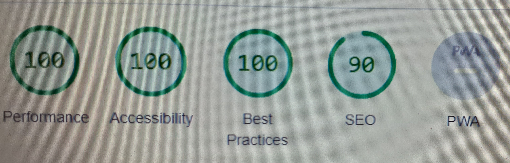

   # Rock Paper Scissors
 A basic fun game, lets you to play with computer. you click on your choice (rock, paper, scissor) and computer randomly will pick (rock, paper, scissor) so either you will win, lose, or draw.

##Features

- The Header

There is a Header on top of the game with game name.

- Section

Underneath the header you have section with Result, you, and computer box. And then you have click option to click on (rock, paper, scissor). At the end i add a button to reset the game.

## Testing
I tested the website working in chrome, edge, firefox.
I confirmed that this website is responsive, and function
all standard screen sizes using devtools.

## Optimizations
HTML.
No error were returned when passing through the offical W3C validator.
CSS.
No error wete found when passing through the offical validator.
JsHint.
No error, but got warning ('arrow function syntax (=>)' is only available in ES6 (use 'esversion: 6').

Accessibility.
I confirm that color and fonts chosen are easy to read and 
accessible by running it through in devtools.

## Unfix Bugs
No Bugs.

## Credits
Media.

The images in the website was taken from istock free .

For java script function i randomly search on Google to get little help to understand the functions.

---

Happy coding!
